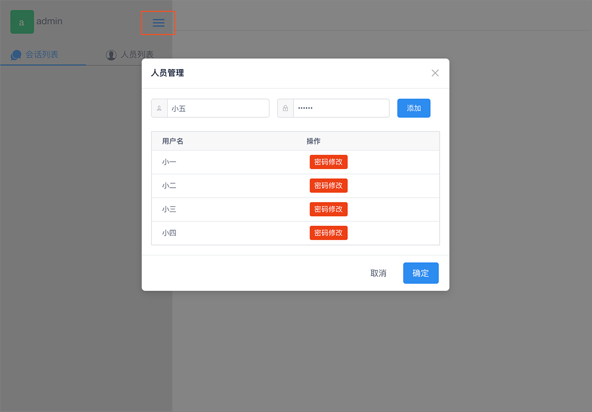
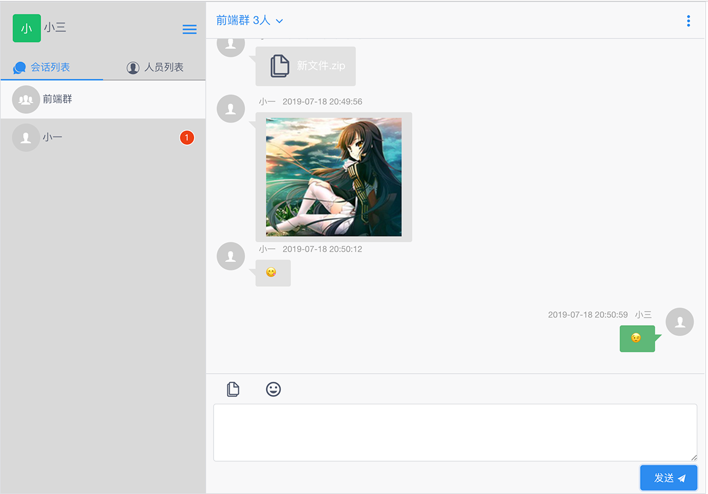
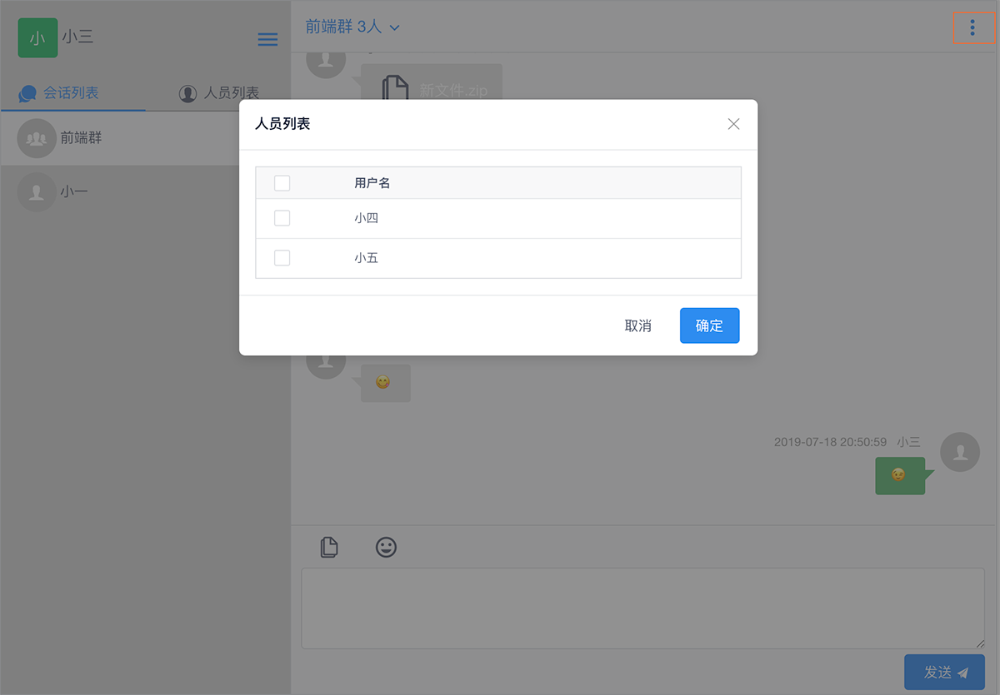

### Qchat
> 一款使用VUE打造的内网办公聊天工具，支持发送图片、文件，群聊，离线消息，消息提醒；类似于WEB版微信

[服务端搭建](https://gitee.com/qice/QchatServer)

#### 项目安装
- 将项目放置到WEB服务器
- 修改index.html中 wsUrl 和 uploadConfig 这两处的地址参考上面服务端搭建

#### 开始聊天
- 默认管理员帐号：admin/111111 登录后记得改密码哦
- 左侧人员管理添加人员
- 后面就开始聊天啦

#### 在线体验
- [点这里（请用Chrome浏览器，网络很慢，请耐心等待）](http://420ac3fa.nat123.cc:29615/chat/) 
- 测试帐号：小一/111111、小二/111111、小三/111111、小四/111111、小五/111111

#### 效果图如下

